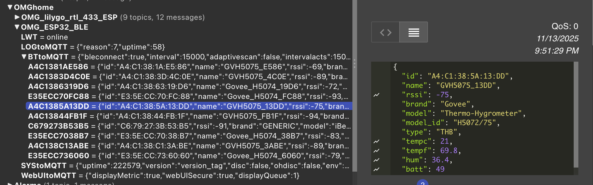
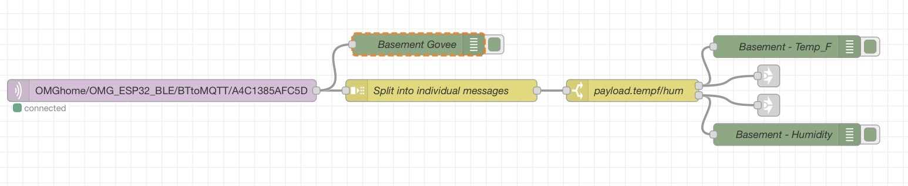
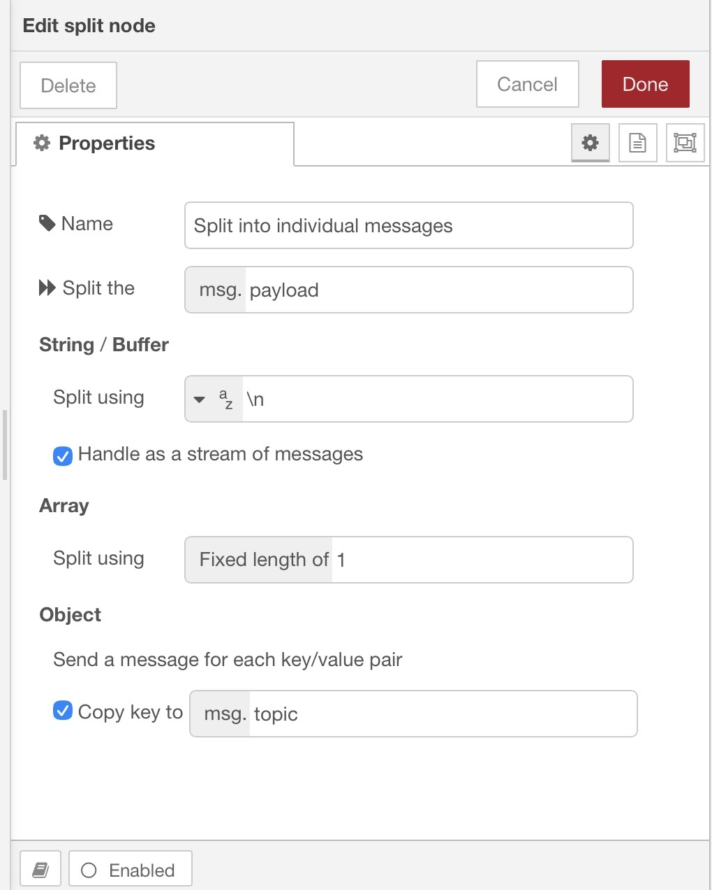
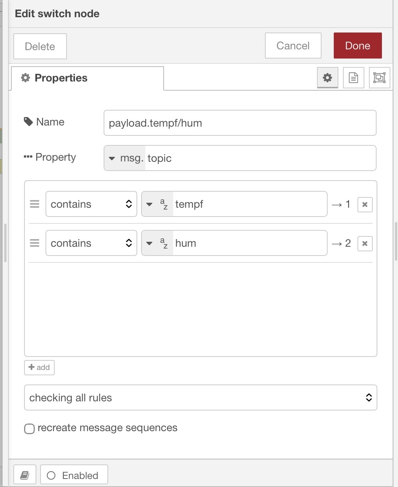

# “Govee Sniffers”  
  
ESP32 D1 Mini boards with OMG “esp32dev-ble’ firmware.  
  
These boards ‘sniff’ for all Bluetooth BLE signals and send the data to the MQTT broker you configure over WiFi. They fit nicely into a 3d printed case and hang from a USB Micro cable plugged into a small USB charger, supplying 5v to the ESP board.   
  
Initial configuration is done through the ‘OMG-32-BLE’ (?) access point. Connect to the network on your phone and set the WiFi and MQTT credentials. Subsequent changes are done by pulling up the device IP address.  
  
If there are a lot of BLE devices in the area, you may want to create a “white-list” for the MQTT broker to limit it to just the devices you want to track.  
  
Use NodeRed flow to send desired data to a dashboard (or ?).  
The last few I set up were intended to monitor commercial refrigerators and freezers to track the temperatures and send alarms if any fell below a set temperature (using ‘Remote-RED’ push notifications).  
#   
## OMG_ESP32_BLE  
Install from Web ([https://docs.openmqttgateway.com/upload/web-install.html](https://docs.openmqttgateway.com/upload/web-install.html) from Chrome), choose ‘ESP32Dev-BLE’ configuration for either ESP 32 D1 mini or DEVKIT v1. Hold boot button when plugging in to DEVKIT, just download to D1 mini.   
  
Reconnect power to open captive portal (SSID ‘OMG_ESP32_BLE’) to set up Wi-Fi and MQTT  
Must provide gateway password   (admin / R&W)  
  
Make white list to restrict how many devices are reporting to MQTT. Use MQTT explorer to publish the white list then use following commands to speed up reporting.  
  
**WHAT WORKS! In MQTT Explorer, publish to topic below (formatting is critical) (use of jsonformatter helps)**  
** (redo quotes and check formatting if showing error)**  
  
home/OMG_ESP32_BLE/commands/MQTTtoBT/config       (change path as needed)  
  
***NOTE: Use “Retain” checkbox ONLY for white lists or black lists. ALL other commands use ‘“save”:true’ to retain in ESP flash memory**  
```
{
   "white-list":[
      "A4:C1:38:2F:89:B0",
      "A4:C1:38:5A:FC:5D",
      "E3:5E:CC:81:C4:80"
   ]
}

```
  
The following commands reportedly speed up reporting of Govees and limit messages to temperature topics and ‘iBeacon’ topics **(uncheck ‘Retain’ - use ‘“save”:true’ to retain in ESP flash memory)(not sure if/how this works - don’t see any difference)**  
```
{
   "adaptivescan":false,
   "interval":15000,
   "intervalacts":15000,
   "scanduration":15000,
   "onlysensors":true,
   "save":true
}

```
[Govee/Arduino/ESP32](https://www.davidpilling.com/wiki/index.php/GASP)  
[ESP32 D1 Mini Case by briancmoses | Download free STL model | Printables.com](https://www.printables.com/model/224998-esp32-d1-mini-case)  
Note on case: lid brim hits reset switch on the board, preventing the lid from fitting properly. Cut a little off of the brim to fix.  
  
## Using the OMG-ESP32-BLE with Govees:  
  
Below is a screenshot from MQTT Explorer showing how the Govee devices report to MQTT with OMG.   
  
The MQTT topic for the highlighted thermometer is ‘OMGhome/OMG_ESP32_BLE/BTtoMQTT/A4C1385A13DD’  
  
From the Debug in Node RED…  
  
OMGhome/OMG_ESP32_BLE/BTtoMQTT/E35ECC81C480  
{  
    "id": "E3:5E:CC:81:C4:80",  
    "name": "Govee_H5074_C480",  
    "rssi": -83,  
    "brand": "Govee",  
    "model": "Thermo-Hygrometer",  
    "model_id": "H5074",  
    "type": "THB",  
    "tempc": 9.63,  
    "tempf": 49.334,  
    "hum": 31.77,  
    "batt": 100  
}  
  
  
  
  
  
NodeRED nodes for splitting MQTT messages:  
  
[{"id":"67112321887085cf","type":"mqtt in","z":"da703f64c771c679","name":"","topic":"OMGhome/OMG_ESP32_BLE/BTtoMQTT/A4C1385AFC5D","qos":"1","datatype":"auto-detect","broker":"5658d9f121988d23","nl":false,"rap":true,"rh":0,"inputs":0,"x":252,"y":966,"wires":[["c9860f8023b648b7","163fe02c763ba1ed"]]},{"id":"163fe02c763ba1ed","type":"debug","z":"da703f64c771c679","name":"Basement Govee","active":true,"tosidebar":true,"console":false,"tostatus":false,"complete":"true","targetType":"full","statusVal":"","statusType":"auto","x":601,"y":903,"wires":[]},{"id":"b9b5fd50b72b18b5","type":"switch","z":"da703f64c771c679","name":"payload.tempf/hum","property":"topic","propertyType":"msg","rules":[{"t":"cont","v":"tempf","vt":"str"},{"t":"cont","v":"hum","vt":"str"}],"checkall":"true","repair":false,"outputs":2,"x":892,"y":966,"wires":[["f4823c66afc7904d","076b6212aed6d6de"],["b116fe903f7746be","7e6d341768bf072a"]]},{"id":"f4823c66afc7904d","type":"debug","z":"da703f64c771c679","name":"Basement - Temp_F ","active":true,"tosidebar":true,"console":false,"tostatus":false,"complete":"payload","targetType":"msg","statusVal":"","statusType":"auto","x":1102,"y":906,"wires":[]},{"id":"c9860f8023b648b7","type":"split","z":"da703f64c771c679","name":"Split into individual messages","splt":"\\n","spltType":"str","arraySplt":1,"arraySpltType":"len","stream":true,"addname":"topic","property":"payload","x":632,"y":966,"wires":[["b9b5fd50b72b18b5"]]},{"id":"076b6212aed6d6de","type":"link out","z":"da703f64c771c679","name":"Lab - Temp_F II","mode":"link","links":[],"x":1077,"y":946,"wires":[]},{"id":"b116fe903f7746be","type":"debug","z":"da703f64c771c679","name":"Basement - Humidity","active":true,"tosidebar":true,"console":false,"tostatus":false,"complete":"payload","targetType":"msg","statusVal":"","statusType":"auto","x":1102,"y":1026,"wires":[]},{"id":"7e6d341768bf072a","type":"link out","z":"da703f64c771c679","name":"Lab - Humidity II","mode":"link","links":[],"x":1077,"y":986,"wires":[]},{"id":"5658d9f121988d23","type":"mqtt-broker","name":"HomePi - MQTT","broker":"10.0.1.111","port":"1883","clientid":"","autoConnect":true,"usetls":false,"protocolVersion":"4","keepalive":"60","cleansession":true,"birthTopic":"","birthQos":"0","birthPayload":"","birthMsg":{},"closeTopic":"","closeQos":"0","closePayload":"","closeMsg":{},"willTopic":"","willQos":"0","willPayload":"","willMsg":{},"userProps":"","sessionExpiry":""}]  
